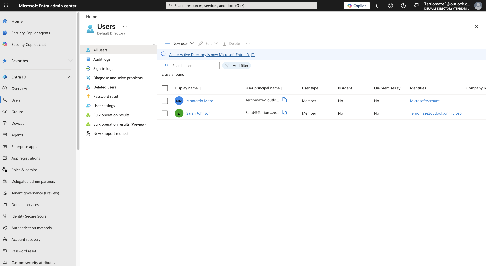
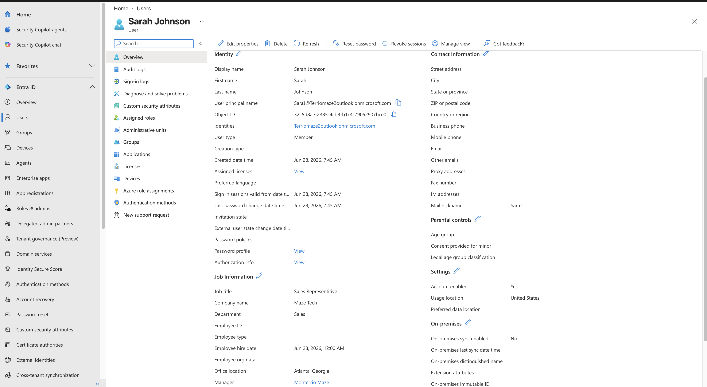
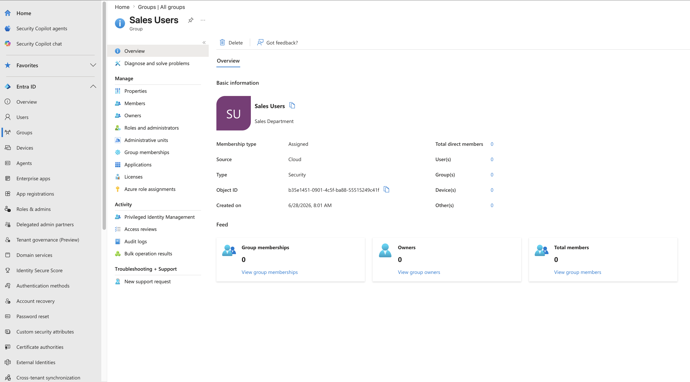
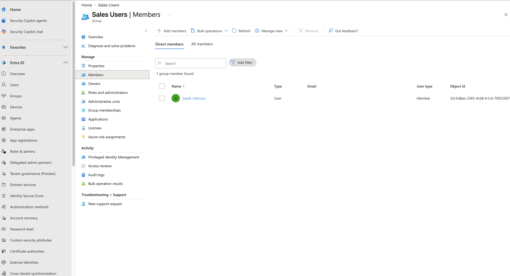
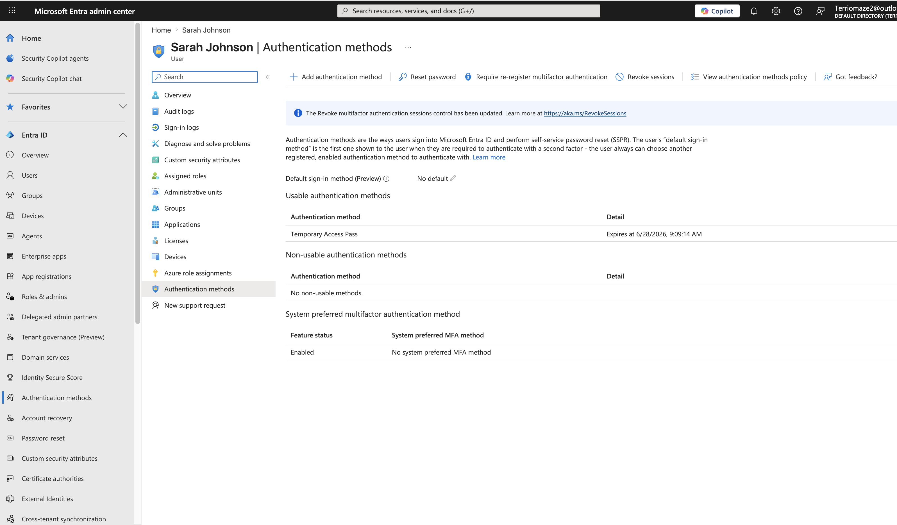
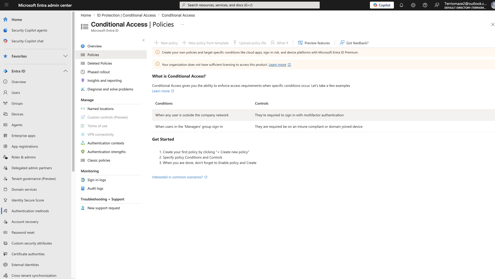
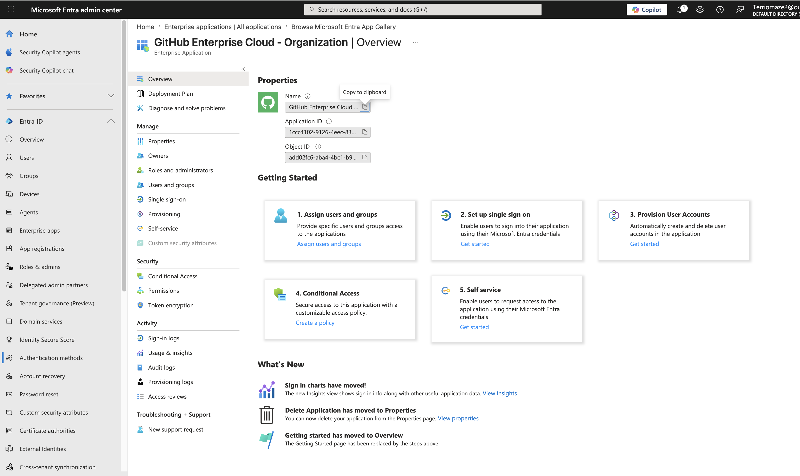
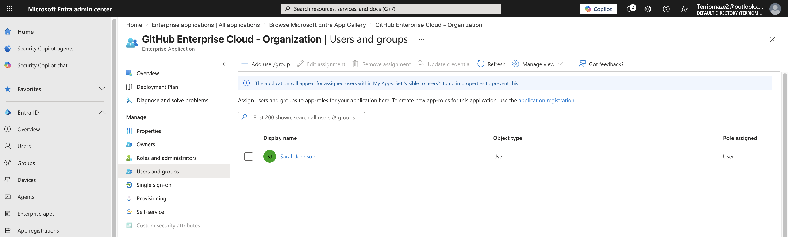
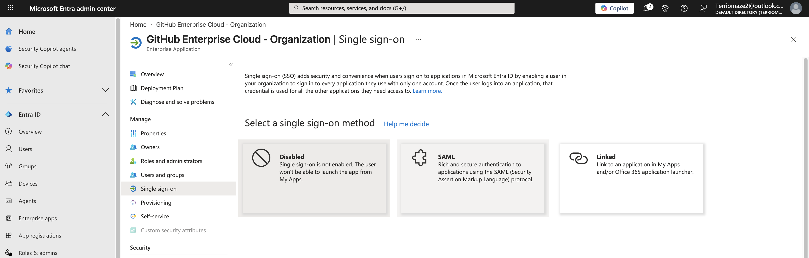
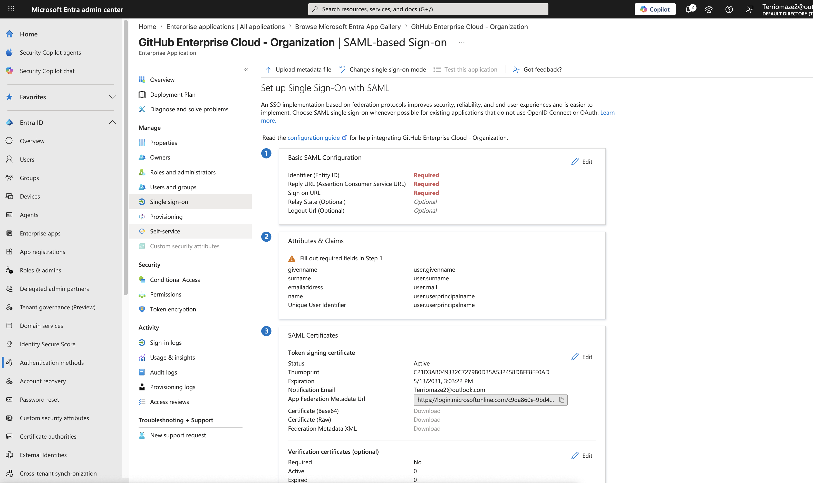

# Microsoft Entra IAM Onboarding Lab

## Overview

This project demonstrates an end-to-end Identity and Access Management (IAM) onboarding workflow using Microsoft Entra ID. The lab simulates how an IAM Administrator provisions a new employee, secures their identity with multi-factor authentication (MFA), assigns enterprise application access, and prepares Single Sign-On (SSO) using SAML.

---

# Business Scenario

A new employee, **Sarah Johnson**, joins Maze Tech as a Sales Representative.

As the IAM Administrator, responsibilities included:

- Creating the user account
- Configuring employee attributes
- Creating and managing security groups
- Assigning group membership
- Configuring MFA onboarding
- Issuing a Temporary Access Pass (TAP)
- Integrating an enterprise application
- Assigning application access
- Preparing SAML-based Single Sign-On (SSO)

---

# Technologies Used

- Microsoft Entra ID
- Microsoft Authenticator
- Temporary Access Pass (TAP)
- Enterprise Applications
- Security Groups
- SAML
- GitHub Enterprise Cloud
- Identity & Access Management (IAM)

---

# Lab Implementation

## Step 1 – User Provisioning

Created a new employee account for Sarah Johnson.

**Screenshot:**  

---

## Step 2 – Configure User Attributes

Configured employee information including:

- Department
- Job Title
- Company
- Employee ID
- Employee Type

**Screenshot:**  

---

## Step 3 – Create Security Group

Created a Security Group named **Sales Users**.

**Screenshot:**  

---

## Step 4 – Group Membership

Added Sarah Johnson to the Sales Users security group.

**Screenshot:**  

---

## Step 5 – Multi-Factor Authentication

Configured a **Temporary Access Pass (TAP)** to securely onboard the employee and prepare MFA registration.

**Screenshot:**  

---

## Step 6 – Conditional Access Licensing Assessment

Navigated to Microsoft Entra Conditional Access and verified that policy creation requires **Microsoft Entra ID Premium (P1/P2)** licensing.

Although the lab tenant did not include the required license, this step demonstrated where Conditional Access policies are managed and documented the licensing requirements for implementing Conditional Access.

**Screenshot:**  

---

## Step 7 – Enterprise Application Integration

Integrated **GitHub Enterprise Cloud** as an Enterprise Application in Microsoft Entra ID.

**Screenshot:**  

---

## Step 8 – Application Access Assignment

Assigned Sarah Johnson access to the GitHub Enterprise Cloud enterprise application.

**Screenshot:**  

---

## Step 9 – Single Sign-On Method

Selected **SAML** as the authentication protocol for enterprise Single Sign-On.

**Screenshot:**  

---

## Step 10 – SAML Configuration

Prepared SAML-based Single Sign-On configuration, including:

- Entity ID
- Reply URL (ACS)
- Sign-on URL
- User Attributes & Claims
- SAML Certificates

**Screenshot:**  

---

# IAM Concepts Demonstrated

- Identity Provisioning
- User Lifecycle Management
- User Attribute Management
- Security Groups
- Group-Based Access Management
- Multi-Factor Authentication (MFA)
- Temporary Access Pass (TAP)
- Enterprise Application Integration
- Single Sign-On (SSO)
- SAML Federation
- Conditional Access Licensing Awareness
- Identity Security

---

# Skills Demonstrated

- Microsoft Entra ID Administration
- Identity Provisioning
- User Attribute Management
- Security Group Administration
- Authentication Management
- Enterprise Application Administration
- User Access Management
- SAML Configuration
- IAM Documentation

---

# Key Takeaways

This lab demonstrates a realistic Microsoft Entra ID onboarding workflow by creating a user, managing identity attributes, assigning security group membership, configuring MFA onboarding with Temporary Access Pass, integrating an enterprise application, assigning user access, and preparing SAML-based Single Sign-On. It also documents the Microsoft Entra Premium licensing requirements necessary to implement Conditional Access policies.

---

# Resume Bullet

Built an end-to-end Microsoft Entra ID Identity and Access Management (IAM) onboarding lab by provisioning users, managing identity attributes, configuring security groups, issuing Temporary Access Passes (TAP), integrating enterprise applications, assigning user access, preparing SAML-based Single Sign-On (SSO), and documenting Microsoft Entra Premium licensing requirements for Conditional Access.

---

# Author

**Monterrio Maze**

Aspiring Identity & Access Management (IAM) Engineer

Atlanta, Georgia
